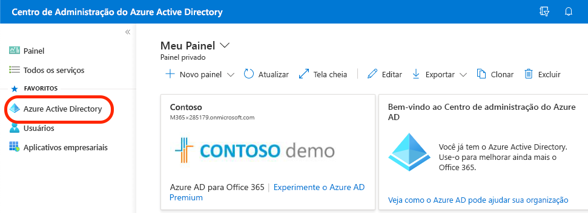
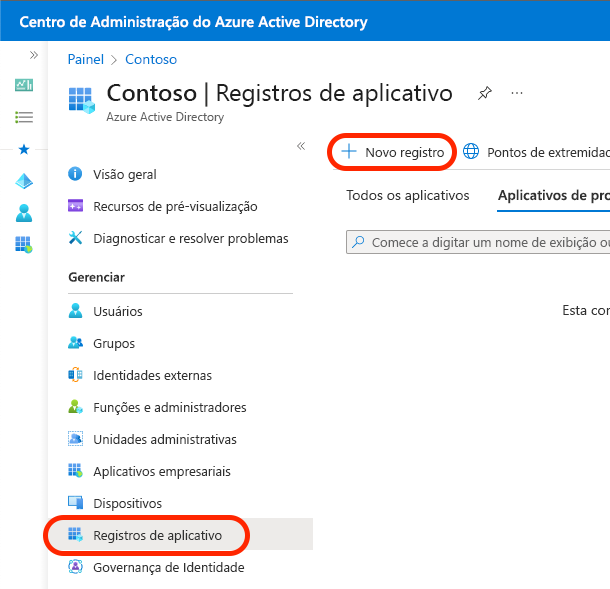
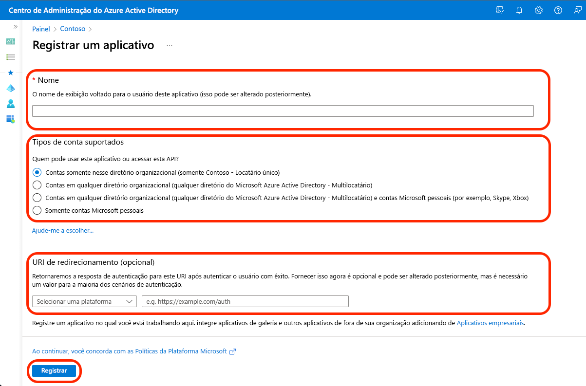
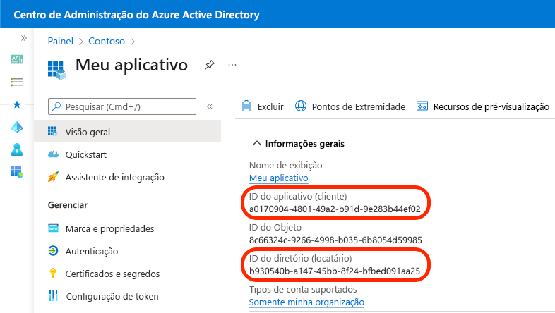

##
### Microsoft Graph
##

### Introdução

Usando o Microsoft Graph, você pode mostrar emails para o usuário atual em seu aplicativo JavaScript. Para ajudar os usuários a examinar rapidamente as mensagens, você pode recuperá-las em páginas. Além disso, para garantir que seu aplicativo seja rápido, você pode carregar apenas os dados necessários do Microsoft Graph.

### Cenário

O Microsoft Graph é o gateway para dados e inteligência no Microsoft 365. Usando o SDK do Microsoft Graph e a Biblioteca de Autenticação da Microsoft, você pode permitir que os usuários se conectem ao seu aplicativo com sua conta Microsoft 365 e mostrem dados do Microsoft 365 em seu aplicativo.

Suponha que você queira criar um aplicativo Web que permita aos usuários acessar rapidamente seus emails mais recentes para ver com quem eles estavam se comunicando recentemente. Você criará um aplicativo que permite que as pessoas se conectem com a conta Microsoft 365. Depois que eles estiverem conectados, você recuperará seus emails recentes usando Microsoft Graph e exibi-los diretamente no aplicativo.

### Pré-requisitos

- Acesso de Administrador Global a um Locatário do Microsoft 365
- Noções básicas de autenticação e autorização no Microsoft 365
- Noções básicas de HTML e JavaScript
- Conhecimento básico do Microsoft Graph
- Node.js LTS

### Objetivos de aprendizado

Ao final deste módulo, você poderá:

Configure um aplicativo JavaScript para recuperar emails usando o Microsoft Graph.
Recuperar e-mails de um usuário do Microsoft Graph.
Dividir grandes conjuntos de dados do Microsoft Graph em páginas.

### Exercício – Configurar um aplicativo do Azure AD para se conectar ao Microsoft 365

Nesse módulo, você mostrará os emails de um usuário recuperados do Microsoft 365 usando o Microsoft Graph. Antes de fazer isso, eles precisam entrar em seu aplicativo com a conta de usuário Microsoft 365. Em seguida, usando o OAuth, você recuperará um token de acesso para seu aplicativo. Com esse token de acesso, você pode chamar Microsoft Graph e recuperar dados de Microsoft 365 para o usuário.

Para começar, você precisa registrar seu aplicativo Microsoft 365 criando um registro de aplicativo no Azure Active Directory (Azure AD). Para esse módulo, você precisará de um aplicativo com as seguintes configurações:

- **Nome**: Meu aplicativo
- **Plataforma**: SPA (aplicativo de página única)
- **Tipos de conta com suporte**: Somente contas neste diretório organizacional (Locatário único)
- **UrIs de redirecionamento**: http://localhost:8080
- **Permissões da API**: Microsoft Graph User.Read (delegado)

Criar um novo registro de aplicativo do Azure Active Directory seguindo essas etapas:

1 - No navegador da Web, vá para o Centro de administração do Azure Active Directory (https://aad.portal.azure.com).

2 - No menu, selecione **Azure Active Directory**.

  

3 - Selecione **Registros de aplicativos**.

4 - Crie um novo registro de aplicativo selecionando **Novo registro**.

  

5 - Na tela **Registrar um aplicativo**, insira os seguintes valores:

- **Nome**: insira o nome do seu aplicativo.
- **Tipos de conta com suporte**: selecione **Contas somente nesse diretório organizacional (locatário único)**.
- URI de Redirecionamento (opcional): selecione **SPA (aplicativo de página única)** e insira `http://localhost:8080`.
- Selecione **Registrar**.

  

6 - Depois que o aplicativo for registrado com êxito, selecione **Visão geral**.

7 - Copie os valores da **ID do aplicativo (cliente)** e da **ID do Diretório (locatário)** e salve os valores em algum lugar. Você precisará deles nas próximas etapas.

  

### Ferramentas do programador

**Downloads**:

- Visual Studio Code: 
    - https://code.visualstudio.com/download 

Link: https://learn.microsoft.com/pt-br/training/modules/msgraph-show-user-emails/?wt.mc_id=slidescontent_18337_webinar_reactor

